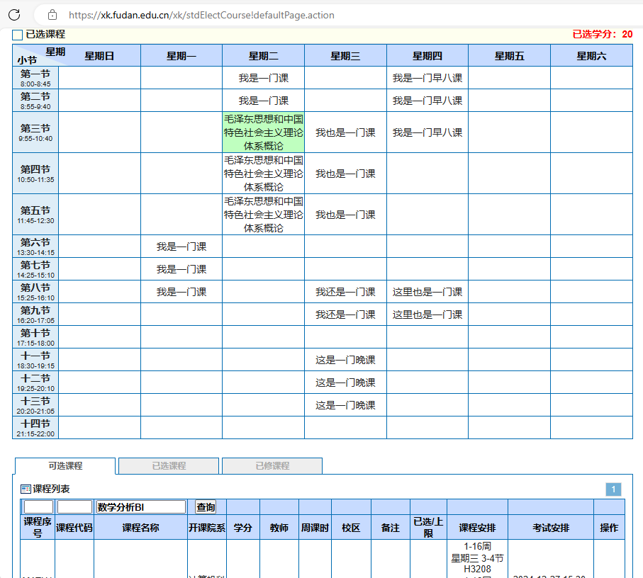
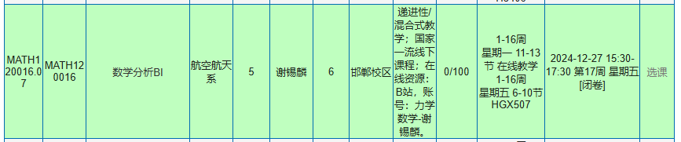

# 怎样使用选课系统？

> 观前提示：
> **freshdan** 只介绍**选课系统的使用流程方法**，不涉及**对各种课程的评价与比较**，也不涉及**课程选择的建议**。选课在培养方案限定的范围内具有一定自由度，课程的体验判断也存在主观性。对于各种选课信息，还请大家自主辨别，做出适合于自己的选课抉择。
>
> 本页最后更新于2024年8月24日。

## 选课前准备

1. **选课时间**：新生入学学期是在第0周（报到周，即正式开始上课的前一周）进行选课，之后每个学期的选课时间大约是在前一学期的期中季附近。

2. 选课网址：**复旦大学选课系统** （[复旦大学选课系统](https://xk.fudan.edu.cn/)）

3. 电子版**课程表**下载：[教务处“工作动态”](https://jwc.fudan.edu.cn/)（以2024-2025学年第一学期为例：[复旦大学2024-2025学年第一学期本科生课程表 (fudan.edu.cn)](https://jwc.fudan.edu.cn/7d/92/c25325a687506/page.psp)）（新生入学学期可能会发放纸质版课程表，之后不再发放）

4. 电子版**培养方案+修读建议**下载：[教务处“本科教学培养方案”](https://jwc.fudan.edu.cn/bkjxpyfa/list.htm)（新生入学学期可能会发放纸质版培养方案或修读建议，之后不再发放；电子版内容较为完整，且后续改动也以电子版为准。）

## 初次选课你需要知道的二三事

!> **先阅读课程表前面的选课须知，先阅读课程表前面的选课须知，先阅读课程表前面的选课须知。**

除此之外：

大学课程以**学期**为单位；

课程的上课时间长短、课程难易度大致通过“**学分**”的多少衡量，哪些课程需要修读多少学分在“**培养方案**”中要求；

每一门课程在完成所有考核与评卷之后给出总成绩并按比例折算为课程的[绩点](gpa.md)，所有学期所有课程的**绩点**对**学分**的**加权平均**即为学生的**总绩点**。

以下默认你已经大致阅读了选课须知。

## 培养方案：要选哪些课？

本步骤的目的是确认你所在的专业需要在哪些学期修读哪些课程。

培养方案或修读建议的电子文件在开学前后通过 [教务处-专业培养-常用文档-本科教学培养方案](https://jwc.fudan.edu.cn/bkjxpyfa/list.htm) 获取。新生入学学期可能会发放纸质版培养方案或修读建议，之后不再发放；电子版内容较为完整，且有任意改动也应当参考电子版。

以下以2022级电子信息科学与技术专业“2+X”教学培养方案及修读建议为例。

!> 每一年级的培养方案及修读建议都可能有部分变动，如图中“形势与政策”I到IV共四门0.5学分的课程已在2023-2024学年第二学期由“强国之路：形势、政策与使命”I到IV代替等等。**请以本年级的培养方案与修读建议中的要求为准。**

毕业的一项要求是“修读完相应课程并达成所需学分数”。

上述的“周学时学期安排”大致可以理解为**学校建议在哪一学期修读多少学分的该课程**。

如上图中大一第一学期（周学时学期安排的“一”）建议修读习近平新时代中国特色社会主义思想概论（数字2表示在该学期修读一门2学分的该课程）、思想道德与法治、形势与政策等课程。

模块课的修读学期不做建议，只要大一到大四共八学期内按照要共计修读够相应学分即可。（如上图要求每一模块2-3学分，不计入第五模块，共计修读8学分；超出的课程学分仍然计入绩点，但不计入培养方案修读的对应部分）。

通常如果大致跟随修读建议的学期要求、并自行合理规划未要求的课程，是可以在毕业前正常完成修读所有课程的。可以根据学分数大致判断一学期的课程学习量。注意根据自身需求，量力而行。

（如果开课学期允许、且确认与相应学期的课程时间段不冲突，完全可以有部分课程在其他学期修读）

## 课程表：哪位老师、哪个时间段？

课程表的电子文件在开学前后通过 [教务处“工作动态”](https://jwc.fudan.edu.cn/) 获取（以2024-2025学年第一学期为例：[复旦大学2024-2025学年第一学期本科生课程表 (fudan.edu.cn)](https://jwc.fudan.edu.cn/7d/92/c25325a687506/page.psp)）。新生入学学期可能会发放纸质版课程表，之后不再发放；电子版内容较为完整，且后续改动也以电子版及网页上的课程表调整为准。

（配图：课程表中的某一门课程示例）
下述均以上述选课序号为**MATH120016.06**的“数学分析BI”课程为例。

选课序号唯一对应于“某一门课”，
选课序号小数点前面的部分即为**选课代码**（如MATH120016），意味着某一门课。
选课序号小数点后面的部分用来区分同一位老师上的不同时间段的相同课程、或不同老师上的相同课程。

### 课程表上的“时间”
一 6-7 \[1-16]

意味着该课程的一个时间段是：第1-16周的周一第6-7节。

如前面图上**MATH120016.06**课程的上课时间是周一6-7节、周一11-13节、周三3-5节共计三个时间段均要上课，从第1周上到第16周。

（通常每学期的第8-11周是大部分课程的期中考试所在的时间，第17-18周是大部分课程期末考试时间，也有部分课程在其他时间完成考核）

!> **建议所选课程的期末考试时间不要冲突。**如两门课程分别在2025-01-02 15:30\~2025-01-02 17:30和2025-01-02 14:30\~2025-01-02 16:30考试，位于同一天的重合时间段，意味着你至少需要将其中一门课申请为缓考。由于学校的绩点给分流程，可能会对成绩造成影响。

## 怎么选课？选课系统及选课流程

[复旦大学选课系统](https://xk.fudan.edu.cn/)

上图中“进入选课>>>>”会在该轮选课开放时显示，点击后即进入下图选课系统。

（配图：选课系统界面及一门课程举例。为了保护个人隐私，已选课程中绝大部分课程名称用无关名字代替）
图中已选入了7门课程（注意同一门课程可能有多个时间段），共20学分。

选课系统的使用流程通常是：
1. 通过**课程表**查得需要的课程的**课程序号/课程代码/课程名称**，

2. 在**某轮选课时间段内**打开选课系统，

3. 在下方查询按钮左侧对应框内输入你需要的课程的**课程序号/课程代码/课程名称**（高峰时段可能无法通过课程名称查询），再点击查询按钮查询，

4. 通过右侧的操作-“**选课**”（见上图）选入该课程，可能需要通过验证码。

## 第一、二、三轮选课介绍

选课、退课、选课申请时间段请参见当学期的课程表。
一轮选课是“抽课”，二、三轮选课是“抢课”。

### 第一轮选课：抽

“不用着急，抽选自己心仪的课程”

以上图为例。上图的人数不代表实际人数，仅用于举例。
在第一轮选课的时间段内，可以通过上述的“选课”，在自己的课程表上自由排入课程。排入课程仅为预选，大部分限制暂不生效：时间可以重叠，每一类课程没有选择数量上限，每一门课程的人数没有上限等等。
而第一轮选课的诸多**限制**在该轮选课时间段结束**之后**生效，在下一轮选课时才能查看该轮的正式选课结果。

### 第一轮选课的限制

1. **课程时间段不重合**。预选时时间重叠的课程由系统任意选择一门踢出。这一项很好理解：你不能在同一时间上很多门课（除非通过申请免听其中的部分课程）。这一项限制是每一轮选课都存在的，只是在预选课时为了方便，临时显示为“重叠”。

2. **只能选择本专业、本年级可以选择的课程**。

3. **如果人数超出课程限制，则将多余人数踢出**。（如上图中只有一半(100/200=50%)人在本轮结束后能真正选到这一门课程），

4. **每学期只能选至多一门英语、一门体育、一门思政课。**根据选课须知中的阐述如果英语、体育、思政等课程每类超过一门，会先踢到该类只剩一门，再根据人数限制确认该门课程是否成功选入。、（实际根据修读建议，是可能在一学期内同时选入某些种类的两门思政课的）

（举例：**同类课不是选越多越好**。如一轮预选时选择了一门人数为32/20和一门人数为16/18的两门英语课，先会随机踢掉其中的某一门；如果正好踢掉后者，则前者只有20/32=62.5%的概率选中，即虽然选择了这样两门体育课但踢掉后者时只有62.5%的概率拿到前者；但如果只选择了一门人数为16/18的英语课，则一定能选中）

除此之外可能还有其他限制，在此略去，详见选课指南。

### 第二轮选课：抢

“急着去抢课”

本轮选课时间较短，仍然只能选择本专业、本年级可以选择的课程。

与第一轮选课不同，本轮只要在选课时间段内看到某一门课程未选满（有余量，如人数为16/20），且不满足选课限制，则可以**立刻**点击选课按钮选入该课程。

“未选满”可能是该门课程增加了选课人数上限，或有人退掉了该课程。但在本轮选课中，课程的余量并不是退掉课程时就立即显示的，而是**在每天固定时间**（见课程表，常见的时间点为13:00）刷新。

应用的场景通常有：某一门心仪的专业课或者英语课等等人数超额、但在第一轮“没roll到”（即没抽选到），可以在后面几天的13:00刷新选课系统“抢课”。

（ps. 通常很热门的课都是一有名额，几秒钟之内就被抢掉了）

### 第三轮选课：还是抢

“还有要抢/蹲的课”

本轮选课时间较长，放开了大部分选课限制，但根据课程要求及教务设置，可能仍然存在部分限制。
可以“抢入”的课程不再局限于本专业、本年级，而通常**可以选择其他年级、其他院系其他专业开设的课程**。

本轮选课的余量通常仍然在每天固定时间（见课程表，常见的时间点为13:00）刷新。

（ps. 如果有一门非常想上、但没选到的课，往往可以通过每天13:00定时定点蹲抢，多蹲几天抢到的可能性还蛮大的！）

## 选课申请与退课介绍

### 选课申请

选课申请通常应用于：某一门课实在无法通过正常选课流程选入，可以通过 [教务服务](https://jwfw.fudan.edu.cn/)-选课事务申请 的方式向教务员提出申请，通过时间不定。

教务员通常会优先通过大四缺学分的同学的申请，详见选课事项须知。

### 退课

常见的退课方式有两种：
1. 在选课阶段、或开课后一定时间内**免费退课**（详见课程表，通常为学期的第一、二周的某些时间段，与选课时间相近），
2. **期中付费退课**。费用与学分成正比，如2023级退课为168元/学分。

免费退课时释放的余量会在特定时间（如下午13:00）余量刷新时再显示，详见前述第二轮选课部分。

期中付费退课需要按照每学分一定价格缴费，具体时间通常会通过复旦大学教务处公众号、辅导员的班级通知等方式通知。

## 补充：怎样确定一门课的课本？

首先，体育课通常没有课本，大部分模块课只提供参考资料，“强国之路：形势、政策与使命”没有课本。

最权威的方法当然是在开学上课后询问老师或助教。
大部分课程还可以通过查看**课程大纲**来确定课本：

在 [教务服务](https://jwfw.fudan.edu.cn/)-课程大纲查询 中搜索所需的课程序号或课程名称，

在“课程序号”处如果包含“大纲下载”（图中红字部分），则可以点击下载课程大纲文件，也可以选中后在左上角“下载”处批量下载。

课程大纲“教材和教学参考资料”中第一行通常为该课程的教材。如上图中数学分析BI课程的一本教材为《数学分析（上）》（第2版，陈纪修、於崇华、金路）。

> 搜不到课程大纲怎么办？
> 可能是授课老师还没来得及上传课程大纲。
> 如果该老师的这一门课程不是第一年开课，可以**将“学年学期”调至之前学年的相应学期**查看是否有大纲。
> 通常之前学年的课程大纲上传更加完善，其中使用的教材可供参考。
> 如果还是找不到，可以问问老师、助教、上过本课程的学长学姐等。

